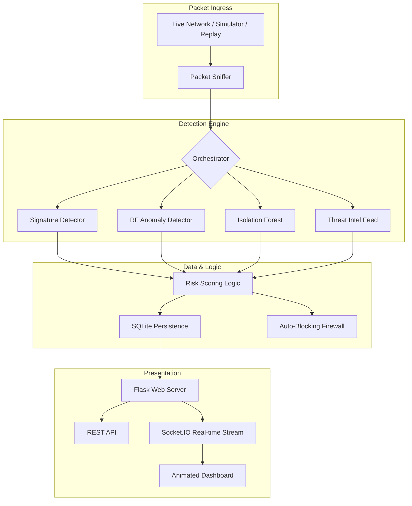

# 🛡️ Hybrid Intrusion Detection System (HIDS) Pro

[](https://opensource.org/licenses/MIT)
[](https://www.python.org/downloads/)
[](https://flask.palletsprojects.com/)

**Hybrid IDS Pro** is a state-of-the-art security monitoring platform that combines traditional **Signature-Based Detection** with advanced **Machine Learning Anomaly Detection**. It provides real-time visibility into network threats with a premium, animated dashboard and a powerful forensics engine.

---

## 🚀 Key Features

- **Dual-Tier ML Detection**: Uses both supervised **Random Forest** and unsupervised **Isolation Forest** models for 99%+ detection accuracy.
- **Dynamic Risk Scoring**: Real-time 0–100 risk calculation based on attack type, persistence, and ML confidence.
- **Interactive Pro Dashboard**: A high-performance, dark-mode interface with live WebSocket streams, GeoIP mapping, and micro-animations.
- **Threat Intelligence**: Automated integration with malicious IP feeds (e.g., abuse.ch).
- **Attack Replay Forensics**: Replay historical attacks back through the pipeline for demonstration and rule tuning.
- **Consolidated REST API**: Clean JSON endpoints for external SIEM/SOC integration.
- **Automated Firewall**: Virtual auto-blocking of persistent threat actors.

---

## 🏗️ Architecture



---

## 🛠️ Tech Stack

- **Backend**: Python, Flask, Flask-SocketIO
- **Detection**: Scapy, Scikit-learn, Pandas, NumPy
- **Storage**: SQLite3, Joblib
- **Frontend**: Bootstrap 5, Chart.js, Leaflet.js, CSS3 (Glassmorphism & Keyframes)
- **Deployment**: Docker, Docker Compose

---

## ⚙️ Installation & Setup

### 1. Clone the & Install Dependencies
```bash
git clone https://github.com/arjunnvarshney/Hybrid-Intrusion-Detection-System.git
cd Hybrid-Intrusion-Detection-System
pip install -r requirements.txt
```

### 2. Train the AI Models
*Crucial: Ensure your models are synced with your environment.*
```bash
python src/model_training/train.py
```

### 3. Launch the System
```bash
python main.py
```

---

## 🖥️ Usage Modes

| Command | Mode | Description |
| :--- | :--- | :--- |
| `python main.py` | **Live/Simulated** | Monitors live traffic (if root) or runs the attack simulator. |
| `python main.py --replay` | **Attack Replay** | Loads historical threats from the DB and replays them live. |

### Accessing the Dashboard
- **URL**: `http://127.0.0.1:5000`
- **Default Username**: `admin`
- **Default Access Key**: `password`

---

## 🌐 API Reference

| Endpoint | Method | Description |
| :--- | :--- | :--- |
| `/api/alerts` | `GET` | Recent 100 security alerts (JSON) |
| `/api/system_stats` | `GET` | Health metrics (CPU, RAM, PPS) |
| `/api/top_attackers` | `GET` | Ranking of malicious source IPs |

---

## 📄 License
This project is licensed under the **MIT License** - see the [LICENSE](LICENSE) file for details.

---
*Created with ❤️ by Arjun Varshney*
